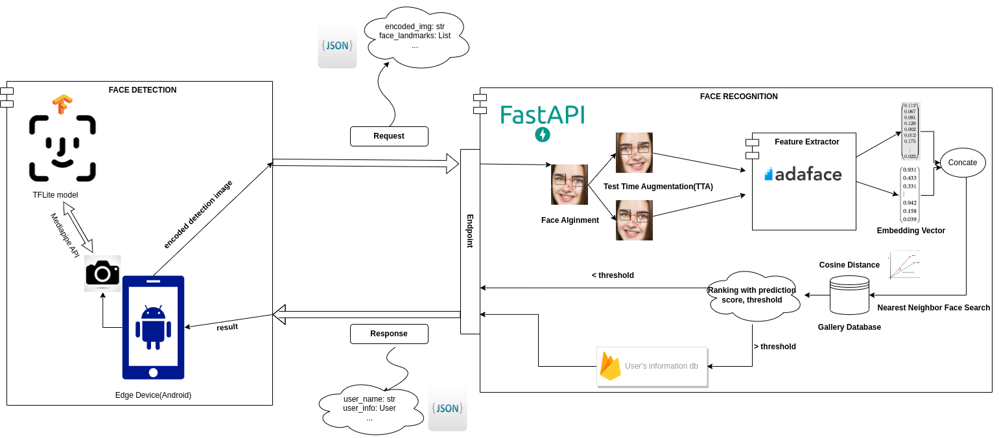

# FaceID system
My own project about FaceID System, which is made based on FaceID system in real-world.
## Summary
The project contains 3 major modules:
* **Face Detection Module**: This can be runned real-time on edge devices, for me, I made an android application (Java) to receive the input camera and detect face bounding box and landmarks. I used [BlazeFace](https://arxiv.org/abs/1907.05047) model, which is a good choice for accurate lightweight face detection on edge devices, the Mediapipe API on android is also helpful for me to used when I made Android application. The detection image then pass to an alignment procedure to frontalize the face.
* **Face Recognition**: Most important part, currently I used AdaFace, [AdaFace: Quality Adaptive Margin for Face Recognition](https://arxiv.org/abs/2204.00964),a SOTA face recognition in low quality image scenerios. It has its public code implementation and pretrained model, so It would be easy for me to accomplish it and use it.
* **Face search**: Since my gallery contains ~ 100 images, linear search is an acceptable choice. However, for scalibility's purpose, I used [hnswlib](https://github.com/nmslib/hnswlib), which is a fast nearest neighbor search for large scale image search.


## Problem
The problem can be described as:
* Has a image database of K members (gallery), can be stored on server.
* The detection result(bounding box and landmarks) is used to cropped on application, then send request to server through FastAPI(on server). The image sent can be encoded into a byte string, then the server receives and decodes it. 
* The server will run the recognition model to get Face Embedding vector and search it in database. The result is then send back to the edge device to show the result.


## Overview

<p style="text-align:center;"></p>


The figure above showed the work flow of the FaceID system:
* **Face Detection**: deployed on android devices, supporting [MediaPipe](https://google.github.io/mediapipe/solutions/face_detection.html) android API to load the **tflite Blazeface** model and used for detection.
  * Input:
    * **Camera Input**: real-time face and landmarks detection at every frame. The image detected with a acceptable threshold will be cropped and sent to the server. Since we won't send many images detected each frame due to overloading, we just sent each frame detected every 0.5 second.
    * **Image Input**: just detect with a given image in storage and send the result to server.

* **Face Recognition**: deployed on my own server, with RTX 2080ti, the AdaFace model repo can be found [here](https://github.com/mk-minchul/AdaFace). I used ResNet50 backbone as feature extractor and used the pre-trained weight with ms1mv2 dataset. 
  * **API service**: [FastAPI](https://fastapi.tiangolo.com/), implement 2 "HTTP" methods for operation.
    * ```python
        @app.post("/predict") 
        async def prediction(obj: JSONObjectPredict): 
          """something"""
    * ```python
        @app.post("/register")
        def register(obj: JSONObjectRegister): 
          """something"""
    * ```python
      class JSONObjectPredict(BaseModel):
          file_name: str     # file_name
          image: str         # image byte encoded
          keypoints_x1 : int # landmarks
          keypoints_y1 : int
          keypoints_x2 : int
          keypoints_y2 : int

      class JSONObjectRegister(BaseModel):
          user_name: str    # user name
          first_img: str    # 3 face images
          sec_img: str
          third_img: str 
  * [**Ngrok**](https://ngrok.com/): create tunnel to expose a my local server to the Internet
  * **Face search**: use liner search or KNN search for small scale gallery images(<100), change to [Hnswlib](https://github.com/nmslib/hnswlib) for large scale gallery images for better retrievel and efficient storage.
  * **Test Augmentation Time (TTA)**: very useful, flipped input image and extract 2 embeddings, then concate it to get a new embedding.
  * **Ranking**: first, find 5 most similar faces with least cosine distances. Filtering some faces under a threshold, then take most frequency face and least distance in the list as a final result. 
## Installation
```bash
pip install -r requirements.txt
```
## How It's used?

```bash
USE_NGROK=True python server.py
```

* When running the server, copy the ngrok URL and modify the `requested_url` in `RegisterActivity.java` and `FaceDetectionResultGlRenderer.java`, then enjoyed it :).


## Challenges
* Remain some problems when send many requests to server.
* Detected images had many variants scenerio -> harm recognition performance

## What next?
* Maybe, make some submodules for classification the detected images(blurred, ...) for a cleaner face to extract better feature.


